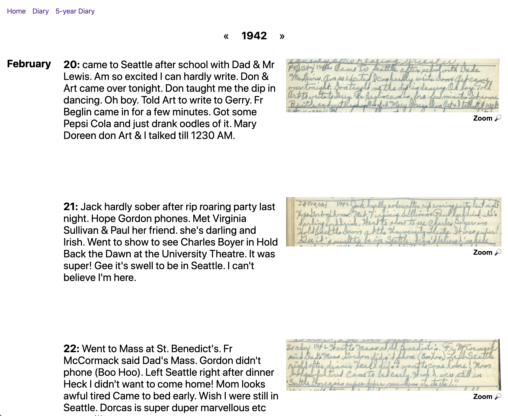

# Gram Betts Diary Gallery

Browse some of my grandmother's diaries from her teenage years, including transcriptions.



Built with Preact and HTM. Works in modern browsers with no build step.

I chose to self-host my packages like `preact` and `preact-router` (different from the documentation, which hotlinks to unpkg.com URLs) because different packages would import different versions of preact. This is definitely one benefit of a build step - webpack can recognise that `preact@>=10` and `pereact@10.14` both satisfy the requirements of the project and only save one version of the module. The browser isn't that smart and downloads several copies.

## Getting started

Use your favorite basic HTTP server from the root of the project, and you're good to go.

For extra credit, make sure all routes are served by `index.html`. Otherwise, sending the browser directly to URLs like `/diary` won't work.

```shell
diary-gallery$ npx http-server --proxy http://localhost:8080?
```
